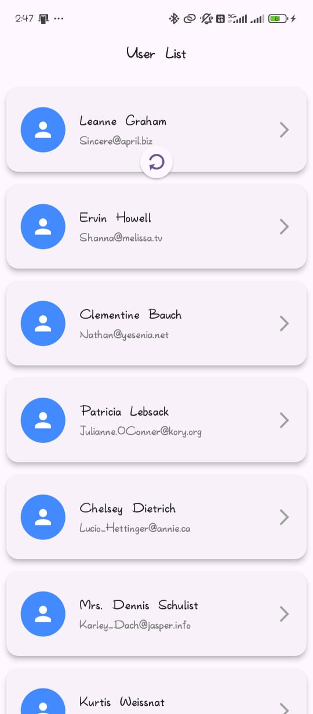

# User List Flutter App

## Project Title and Description

**User List Flutter App**  
This is a simple Flutter application that fetches and displays a list of users from a public API. The app showcases a list of users with their names and email addresses. Upon tapping on a user, it navigates to a detailed profile screen where more information about the user, such as their address and company details, is displayed in a stylish and organized manner.

## Instructions on How to Run the App

### Prerequisites

Before running the app, ensure you have the following installed:
- [Flutter SDK](https://flutter.dev/docs/get-started/install)
- A suitable IDE or text editor (e.g., [Visual Studio Code](https://code.visualstudio.com/) with Flutter and Dart plugins or [Android Studio](https://developer.android.com/studio))
- An emulator or a physical device to run the app

### Steps to Run the App

1. **Clone the Repository:**
   ```bash
   git clone https://github.com/your-username/user_list_app_assignment.git
   cd user-list-flutter-app
   ```

2. **Install Dependencies:**
   Run the following command to install the required packages:
   ```bash
   flutter pub get
   ```

3. **Run the App:**
    - Open the project in your preferred IDE.
    - Connect your device or start an emulator.
    - Run the app using:
      ```bash
      flutter run
      ```
    - Alternatively, use the "Run" button in your IDE.

## Assumptions and Decisions Made During Development

- **User Data API**: The app fetches user data from the public API `https://jsonplaceholder.typicode.com/users`. This API provides dummy data, and the app assumes that the data structure will remain consistent.
- **UI Design**: The app was designed with a simple and clean UI in mind, making use of Flutter’s built-in widgets such as `ListView`, `Card`, and `ListTile` to display the list of users and their details.
- **Error Handling**: Basic error handling is implemented to show an error message if the API request fails or if no users are found.
- **No State Management Library**: The app is small, so no external state management solution (like Provider or Bloc) was used. State is managed locally within the widget using `setState`.

## Screenshots of the App

### Home Screen - User List


### Home Screen - User List



### User Profile Screen


---